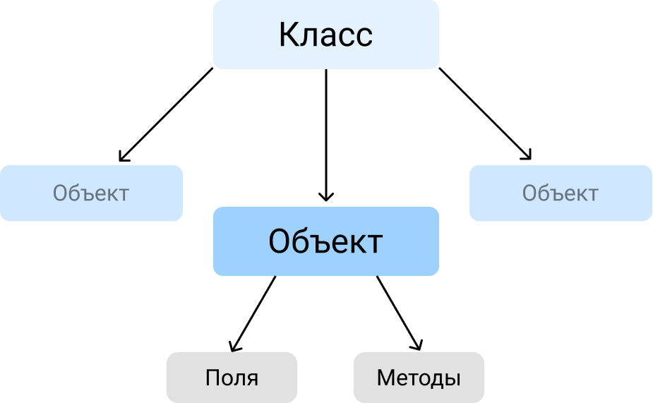

# Объектно-ориентированное программирование. Основы

## Общая информация
<u><b>Объектно-ориентированное программирование(в дальнейшем ООП)</b></u>
предполагает проектирование программного кода, основанное на использовании ***объектов*** и их взаимодействиях друг с другом. ООП особенно полезен при программном представлении объектов и систем реального мира - банковский сектор, сложная механико-инженерная структура, абстракная система взаимодействия людей и так далее.

<u><b>Объект</b></u> - некоторая единица(сущность), имеющая индивидуальные параметры/характеристики/свойства и функциональность объекта реального мира, либо же, чаще всего, представление некоторого элемента программной архитектуры. Объект является конкретным экземпляром своего ***класса***.

<u><b>Класс</b></u> - сложная программная структура(механизм), которую порой называют *абстрактным типом данных*, описывающая общие характеристики и функциональность ***объектов***. Иными словами, ***класс*** является шаблоном с общим описанием ***объектов***. ***Класс*** содержит в себе перечень функций(методов) ***объекта***, определяющих его функциональность, также он определяет атрибуты(поля) ***объекта***, являющиеся его параметрами(иногда их называют свойствами).

<u><b>Методы</b></u> - функции описанные в ***классе***, используемые над ***объектами*** и самими ***объектами*** для манипулирования или изменения их данных.

<u><b>Атрибуты(поля)</b></u> - параметры ***объектов*** описанные в ***классе*** и определяющие их состояние. Представляют из себя базовый набор данных, отличающих один ***объект*** от другого, а так же дополняющих общую информацию о ***классе***.

Визуально общая картина выглядит следующим образом:
<p align="center">

</p>

## ООП в Python
ООП в Python(как и в любом другом языке программирования с ООП) *не является обязательным функционалом языка* при написании программ, тем не менее он является элегантным решением при работе с объектными отношениями, сокращающим написание кода.

ООП занимает значимую роль в языке, взглянуть хотя бы на стандартные и сторонние библиотеки языка - во многих(почти во всех) из них оперирование данными происходит исключительно с позиции работы с параметрами и свойствами общеописанных объектов.

Ключевой особенностью Python является то, что все с чем вы в нем работаете, является объектами - типы данных, структуры данных, даже функции(вспоминаем *Коллбэки*). Проверить это очень просто - например, попробуйте вывести на экран коллбэк функции int:
```python
print(int)
# Вывод:
# <class 'int'>
```

Вы даже не подозривали все это время, пока работали в Python, что имеете дело с ООП-структурой языка! Теперь, когда вы знаете про ***классы***, становится ясно, что глубоко в язык "вшито" объектное отношение между данными и в этом нет ничего плохого, напротив, это во многом облегчает жизнь разработчику, который работает с данным языком.

Вспомним также различные ***методы***, которые вам уже известны: **.append()** у списков, **.replace()** у строк и так далее. Все это те самые ***методы*** описанные выше, которые позволяют манипулировать и менять данные своих ***объектов***.
